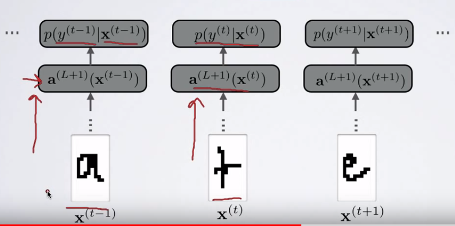
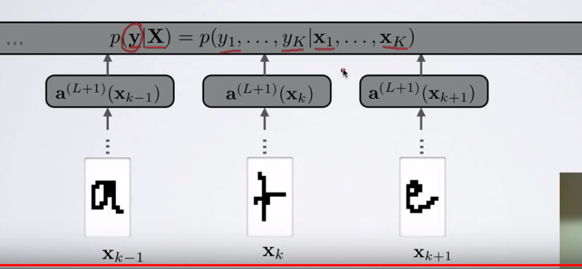
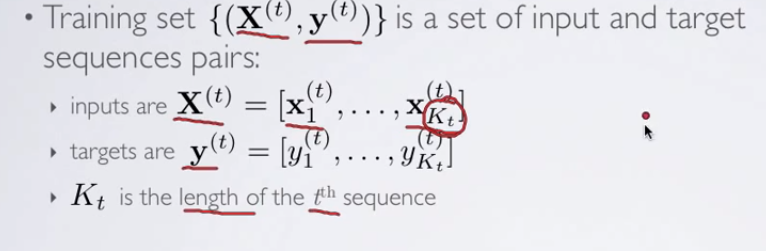

#  Conditional Random Feild
source :https://www.youtube.com/watch?v=GF3iSJkgPbA

- In NN take a single input through the hidden layers we get a output pre-activation and then softmax to give potential label.

##  What if examples are organized in sequence.

- this does not deal with examples organized in sequence.
- e.g. sequence of images of character we want to predict the most probable character sequence.
- certain character are more likely to after certain characters
    - so we would like to exploit this information.

## Model
- input sequence of observations.  
- model the joint distribution over the whole sequence.
- output : sequence of labels. ( most likely sequence)

## Notations

## LINEAR CHAIN CRF
 
- a naïve method for computing partial function Z(x) would be intractable exponential growth

- connecting lateral connection b/w the computation made at different position parameterized by V.

- model dependency with in the sequence.

- previous and next input affect the output at position k.

## Context Window
- set of inputs that influence our prediction.
- include all of input at a position that influence  input.
- for window 1

- 3 NN one at position center 0, left -1 and right +1

## Another alternative
- use a sing NN feed the whole context windows.
- learn whole context jointly.
- if starting and ending of sequence is important
    - use special vector at the boundaries.

## Unary and pairwise Log-factors

- unary log factor:
    - terms that  depends on single y at a single position k

- window based
    - look at only context windows

-pairwise  log-factors

- $$ a_p(y_k,y_k+1) $$

- we call them  log-factors
    - we can write them as product of exponential unary and binary .

$$
\frac{2}{3}
$$
