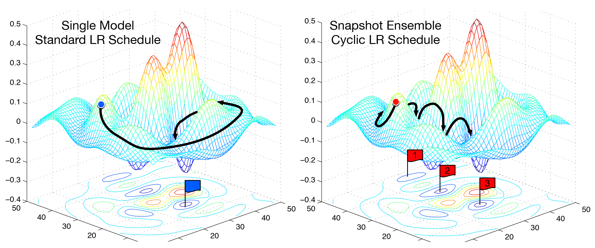
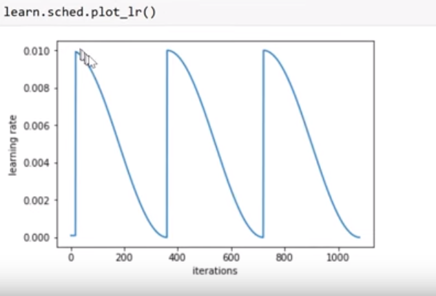

## SGDR (Stochastic Gradient Descent with Restart )

- Variant of Learning Rate annealing
- gradually decrease learning rate as training progresses.
- Cosine annealing- decrease learning rate as a function of cosine half of cosine

However, we may find ourselves in a part of the weight space that isn't very resilient - that is, small changes to the weights may result in big changes to the loss. We want to encourage our model to find parts of the weight space that are both accurate and stable. Therefore, from time to time we increase the learning rate (this is the 'restarts' in 'SGDR'), which will force the model to jump to a different part of the weight space if the current area is "spikey". Here's a picture of how that might look if we reset the learning rates 3 times (in this paper they call it a "cyclic LR schedule"): 

- used to find a generalized minima of function 

- in restarts jumps to other local minima 

- if a minima we find a minima that is generalized well then jump does not make to go to other spikey minima thus covers most of the examples.

  

  

## Training notes:

### Differential learning Data

- using different learning rate for different layers.
- early layers learn the the feature fast and do not change significantly over time
  - generally low learning rate of first few layers and high for last layers
  - no point of training them again.

## 

