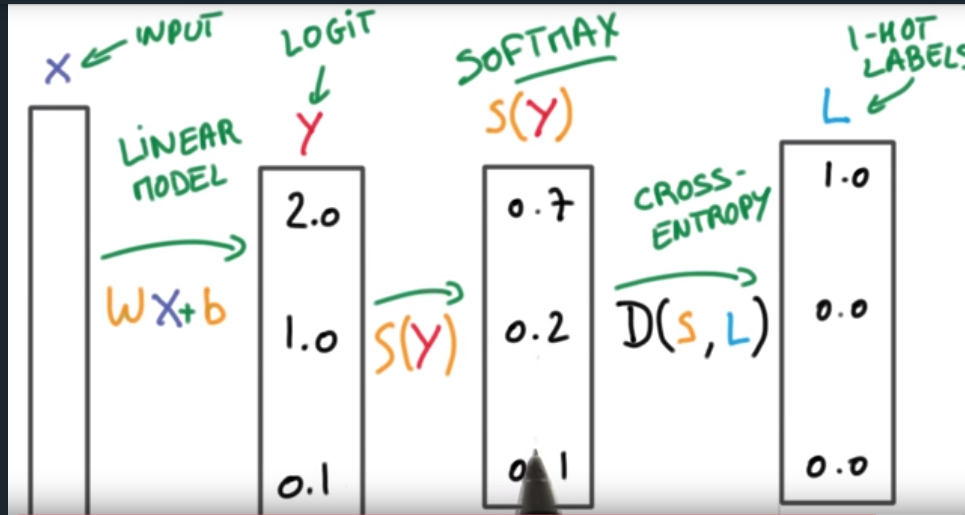
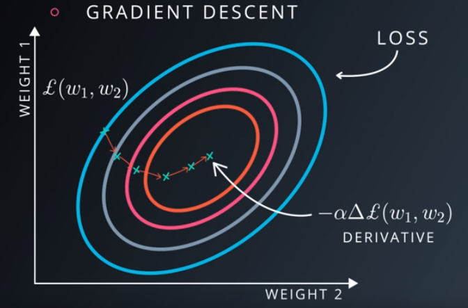
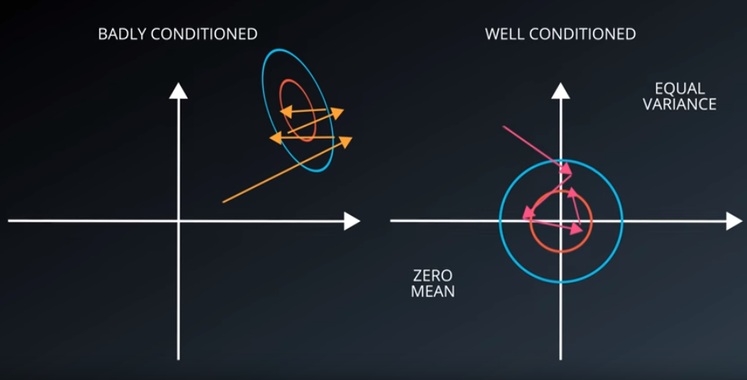
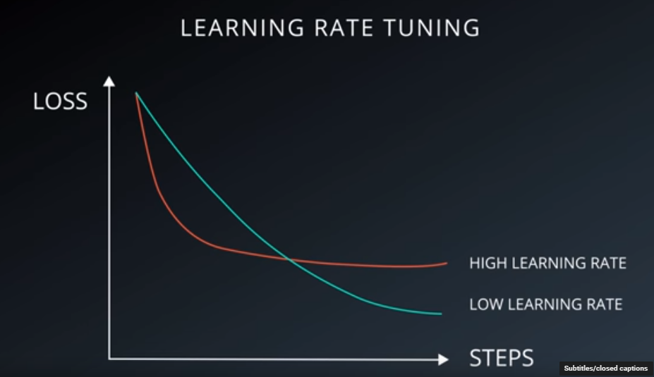

# Introduction

## Why deep learning ?

-  Data lots of data
- high computation power
- solve **PERCEPTION** problem better
  -  Recognizing images
  - what people saying
  - helping robots interact with the world
  - computer vision
  - speech recognition
  - discovering new medicines
  - understanding natural languages
  - understanding documents 

## supervised classification

- detecting pedestrians from the dash camera of car.
  - take a patch and classify it as a pedestrian or non-pedestrian
- web search ranking.
  - take the query and webpage and build a classifier that classifies relevant or irrelevant.

## Logistic classifier

- **W** **x**+ b = y
  - find values for W weights and b bias which are good at perform prediction.
- way to convert score into probabilities using a **soft-max** function:
- $S(y_i) = \frac{e^{y_i}}{\sum\limits_j e^{y_j}}$
- score (often called **Logits score** ) to probabilities that sum to one.

### One-hot Encoding

- S(y)= [0.7 0.2 0.1] $$\rightarrow$$ L [1 0 0 ]

- when we have many classes vector becomes very large 
- most of them are zero

### Cross Entropy

- $D(S,L) = -\sum\limits_{i} L_i log(S_i)$
- $S_i$ (predicted prob.) will never be zero.
- $L_i$ (is the label) as one-hot encoded vector.
- NOTE:  $$ D(S,L)\neq D(L,S)$$

## Multinomial Logistic Classification

- $D(S(Wx+b),L)$

###  Minimizing Cross Entropy( Training Loss)

- we want loss to be small

- Loss = average cross entropy across every examples

- $$L = \frac{1}{N} \sum_\limits{i} D(S(wx_i+b),L_i)$$ 

- solve using mathematical optimization

- Gradient Descent

- 

-  there is always a **numerical stability problem** when we try to add very small to large value many time

- in python adding 1e-6  1000,000 times in 1e9 and -1e9 will not give 1.

- we want the value in the calculation of this loss function not to big not too small

  - we want our variable to be mean zero and equal variance for each axis.

- 

- Badly conditioned a lot of searching for optimizer

-  weights and biases should be initialized at good enough starting point to proceed

  - draw weight with mean 0 and variance $\sigma$
  - Large  $\sigma$ =  Distribution will have large peak and be very opinionated
  - small $\sigma$ = distribution is very uncertain (desired initially).

- Update weights and biases as:

  - $w \leftarrow w - \alpha \Delta_w L$
  - $b \leftarrow b - \alpha \Delta_b L$

  

### measuring performance

- always use three split when dealing with a deep learning model

  -  train set
  - validation set ( for hyper-parameter tuning )
  - test set ( keep this set away ) to avoid over-fitting of model on the test set.

- this validation step is necessary in Deep learning models.

- useful rule of thumbs (**RULE OF 30**)

  - a change that affects 30 example or more examples usually significant.
  - More than 3000 examples in validation in set.
    - changes > 0.1 % in accuracy
  - if class is not balanced this heuristic  is not good.

- getting more data is always best.

  

### Stochastic Gradient Descent

#### problem with gradient descent.

- computing gradient takes 3 times as floating operation than computing loss .
- if data set is big this can be time consuming
- and gradient descent is iterative thus take more time.
- we then use Stochastic Gradient Descent taking small training data sample for doing calculating loss
- SGD scales better for large data.
- Momentum 
  - maintain running average of the the gradients use that avg. gradient instead of current gradient
- Learning Rate decay:
  - as time goes we have to make learning rate smaller and smaller .
- 
- SGD has many hyper-parameter
  - when things doesn't work lower learning rate
  - **ADAGRAD** training 
