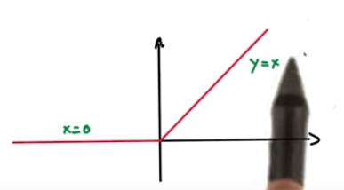
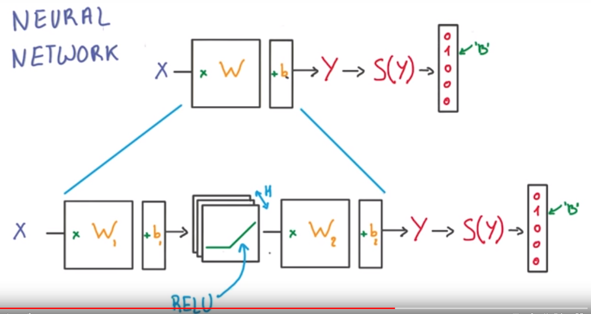

# Deep Neural Netwoks

## Linear Model Complexity/Limitation

- if we have N inputs and k output we have (N+1)*K parameters
-  equation $X \times W +b \rightarrow Y \rightarrow S(Y)$
- X is of N and Y is of K length
- Linear model does not capture complex function
  - $Y = X_1 \times X_2$ does not captured. 
- Linear models are efficient.
- Linear operation are stable 
  - small changes in input leads to small changes in output.
- Linear derivatives are nice
  - constant
- Thus need non linear function

## Rectified Linear units (ReLU)

- simplest non-linear function.
- 

## NN with ReLU

## Back-Prop

