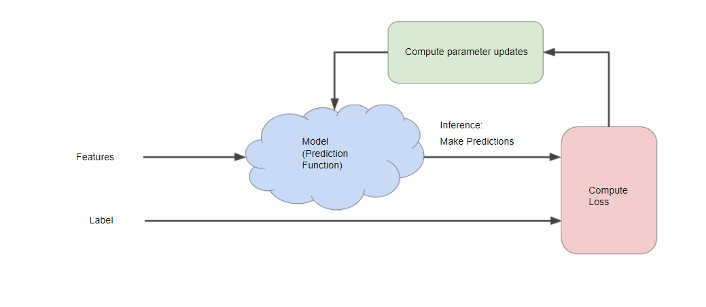
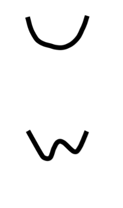

# Introduction to ML

- Tools to reduce programing
- customize and scale products
- ML  lets us solve complete seemingly "un-programmable" problems.

# Framing

###What is (Supervised) Machine Learning?

- ML systems learn
  - how to combine input
    - to produce useful predictions
    - on never-before-seen data

###Terminology: Examples and Models

- **Example** is a particular instance of data, x
- **Labeled example** has {features, label}: (**x, y**)
  - Used to train the model
- **Unlabeled example** has {features, ?}: (**x, ?**)
  - Used for making predictions on new data
- **Model** maps examples to predicted labels: **y'**
  - Defined by internal parameters, which are learned

# Descending to ML

## Learning From Data

- There are lots of complex ways to learn from data

- But we can start with something simple and familiar

- Starting simple will open the door to some broadly useful methods

  

## A Convenient Loss Function for Regression

**L2 Loss** for a given example is also called squared error

= Square of the difference between prediction and label

= (observation - prediction)2

= (y - y')2

predicted value

## Defining L2 Loss on a Data Set

$$L_2Loss = \sum_{(x,y)\in D} (y - prediction(x))^2$$
$$\sum \text{:We're summing over all examples in the training set.}$$
$$D \text{: Sometimes useful to average over all examples,}\text{so divide out by} \frac{1}{\|D\|}.$$

# Reducing Loss

## How do we reduce loss?

- Hyper parameters are the configuration settings used to tune how the model is trained.

- Derivative of $(y - y')^2$ with respect to the weights and biases tells us how loss changes for a given example

- - Simple to compute and convex

- So we repeatedly take small steps in the direction that minimizes loss

- - We call these **Gradient Steps** (But they're really negative Gradient Steps)
  - This strategy is called **Gradient Descent**

## Block Diagram of Gradient Descent

## Weight Initialization

- For convex problems, weights can start anywhere (say, all 0s)

- - Convex: think of a bowl shape
  - Just one minimum

- Foreshadowing: not true for neural nets

- - Non-convex: think of an egg crate
  - More than one minimum
  - Strong dependency on initial values 

- 

- 

## SGD & Mini-Batch Gradient Descent

- Could compute gradient over entire data set on each step, but this turns out to be unnecessary

- Computing gradient on small data samples works well

- - On every step, get a new random sample

- **Stochastic Gradient Descent**: one example at a time

- **Mini-Batch Gradient Descent**: batches of 10-1000

- - Loss & gradients are averaged over the batch