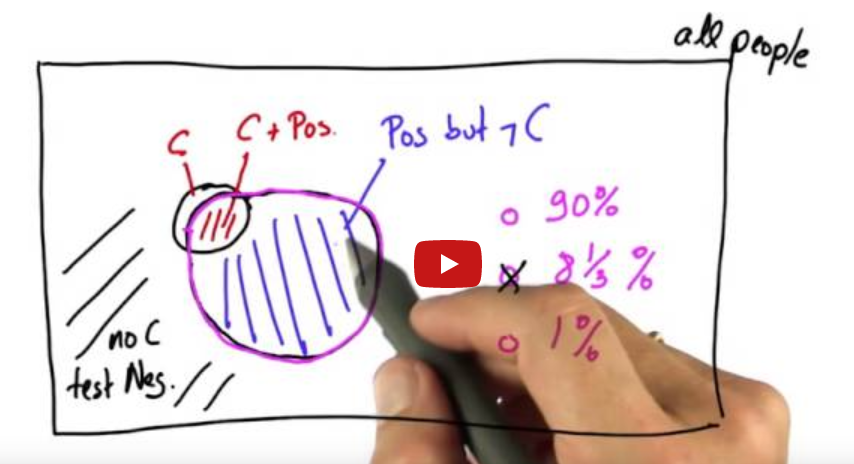
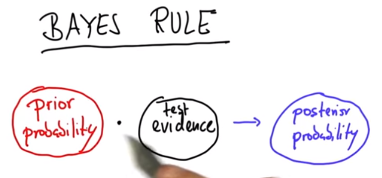
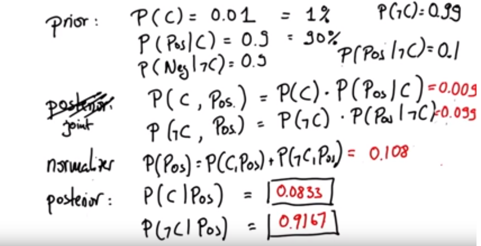
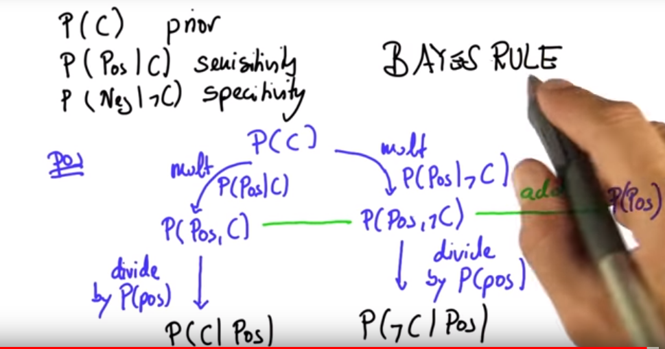
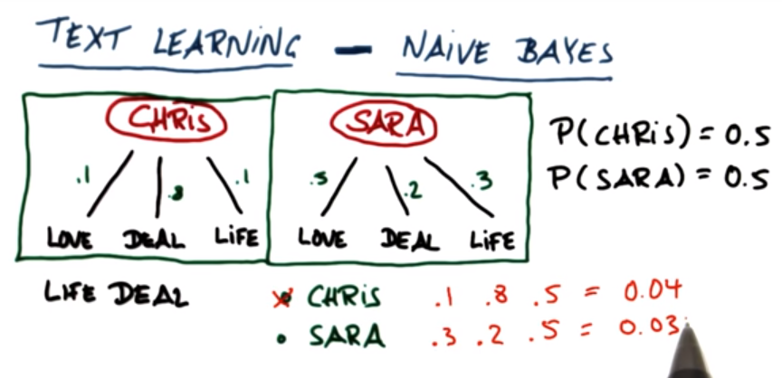
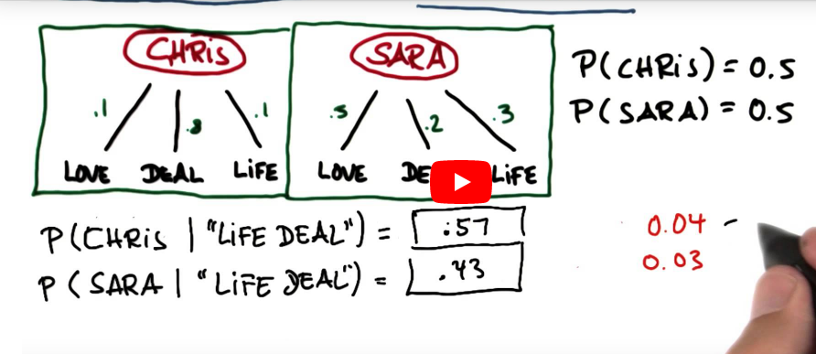

# Naïve Bayes

** supervised learning is about learning through some labelled examples ** 
* regression
* classification

**Input features and predict labels**
## Features for songs classification (Example)
- geners
- pitch
- intensity
- tempo
- gender of voice 
- length

## labels
- Like 
- Dislike

## for classification
Machine Learning algorithm defines a decision surface typical lies somewhere between two data class.

When decision surface is straight line which genearlizes our data well , we call the classifier is called  as **linear classifier **

Machine learning algorithm takes in data and transforms it not the **Decision Surface**.

**  DATA --->  D.S. **

# Naïve Bayes
## sklearn introduction 
http://scikit-learn.org/stable/modules/naive_bayes.html
http://scikit-learn.org/stable/modules/generated/sklearn.naive_bayes.GaussianNB.html

Metrics for comparisons

**Accuracy**

$$ accuracy  =  \frac{\#points\ correctly\ classified} { \# all\ points.} $$

accuracy from ``sklearn.metrics.accuracy`` score function in python 

## Bayes Rule

Cancer Test

**prior probability** - probability before running a test.

after running a test/ experiment  the probability of the even is called **posterior probability**

**NOTE**: also use prior probabilities in calculations For example

 

- independence assumption
- easy to implement
- phrases that means different in different context does not work very well with naïve Bayes.
- 

