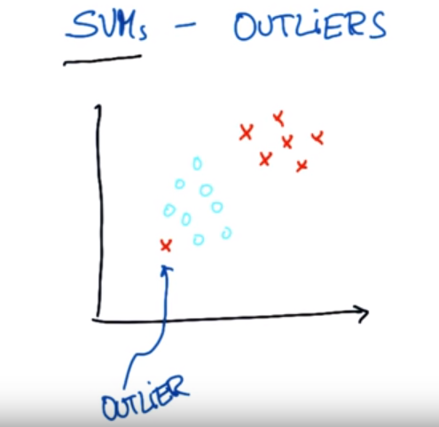
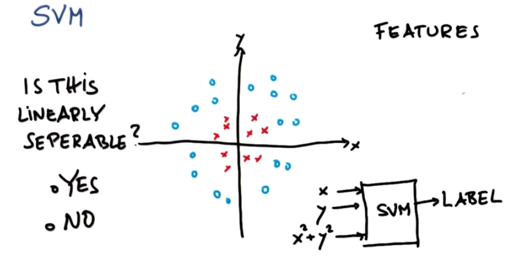
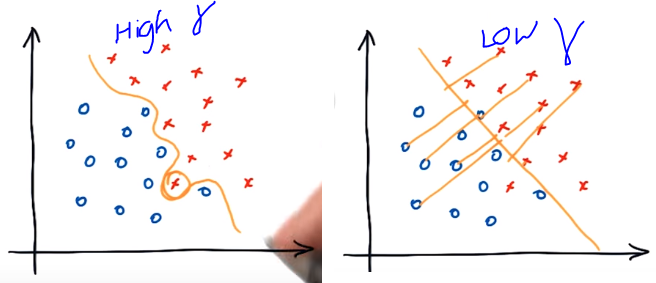

# Support Vector Machine (SVM)

## What SVM does?

- Find a separating **line/ hyper-plane** between data of two classes. the best line separator.
-  It also maximizes **margins** i.e. maximizes distance to nearest point in both class.  
- Insight is to maximize the robustness of the separator ( how it will react to small noisy inputs ).
- first it find a hyper-plane that correct separate the classes then maximize the margin
- we are trying to classify the label correctly also want to maximize the margins.
- SVM can be slow to train .
## What about outliers- SVM

- We want  SVM to robust to outliers.
- 

## Non Linear SVMs

-    
	By adding a new feature x^2 + y^2 the following data is separable.	

  ## Kernel Trick

- kernel are function take lower dimensional feature space  maps it to a very high dimensional space.

- separable in higher dimension

- when we apply SVM on high dimension space  maps back to lower dimension we get a  non linear separation.

- sklearn has different type of kernels

  # Parameters for SVM

  - **KERNEL**

    - RBF
    - Linear
    - sigmoid

  - **C**  penalty

    - controls the tradeoff b/w smooth decision boundary and classifying training points correctly
    - large value of C mean we will expect more training points to be correctly separated.
    - if C is small less penalized thus high variance.
    - if C is large more penailzed thus high bias.

  - **Gamma** $ (\gamma) $

    - Defines how far the influence of single trainining example reaches.
    		- low values - far reach ( far points are also taken in to consideration when choosing a decision boundary)
    		   - less wiggly decision boundary 
    		- high values - close reach 
    		  - low wiggly decision boundary

   - is the parameter to handle non-linear classification (Gaussian kernel)

   - small gamma  implies small radius hence less smooth boundary

## OVERFITTING

non obvious decision boundary that is very complex and that perform best on train data but fail to genearalize for test data. 

