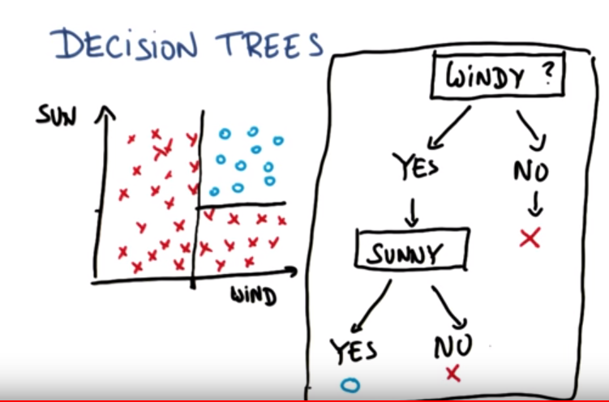

# Decision Tree (DT)

- Most used supervised classification algorithm

- simple and initiative.
- **Tricks : ** using linear decision surface for making non-linear decision making.

## sklearn Tree DecisionTreeClassifier

- avoid over fitting

- tune some parameters

  - **min_sample_split**: whether there are enough sample or training examples to keep splitting or not. Default =2. Likely to overfit with small min_sample_split

- default criterion is ** Gini index ** istead of entropy

## Entropy

- controls how DT decides where to split the data .
- **Definition:**  It is measure of impurity  in a bunch of examples. 

  - refers to disorder or uncertainty
  - expected number of bits of information contained in message.
  - how much useful information is expected to contain
- **mathematically**
  - $$\sum_{i} -p_i * log_{2}(p_i) $$
  - all examples of same class entropy will be zero
  - if eamples are evenly splitted b/w calsses then entropy will be 1.0
  
## Information Gain (or KL divergence)
- tells us how important a given attribute of the feature vector is .
- it is defined as entropy of parent minus weighted average of entropy of children if we split that parent
- $$ information\ gain = entropy(parent)- [weighted\ average] entropy(children) $$
- Decision tree algorithm will maximize the information gain.

## Bias and Variance
- high bias ML algo practically ignores data that does not have capacity to learn anything. (too genearlized to every perfom)
- ML algo that almost every time replicates the training data is said to be suffering from high variance problem. it momorizes the training examples thus highly overfitted. 
	- work very poorly on test data.(less generalized).
- we want something in middle of the two.

## Disadvantages Of DT
- prone to overfit
- parameter tunning required

