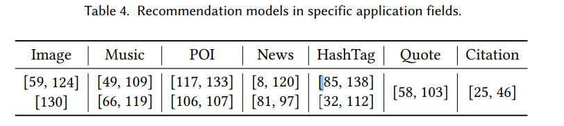
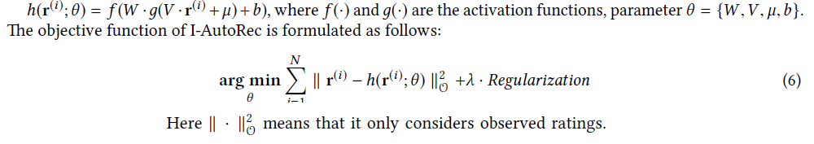
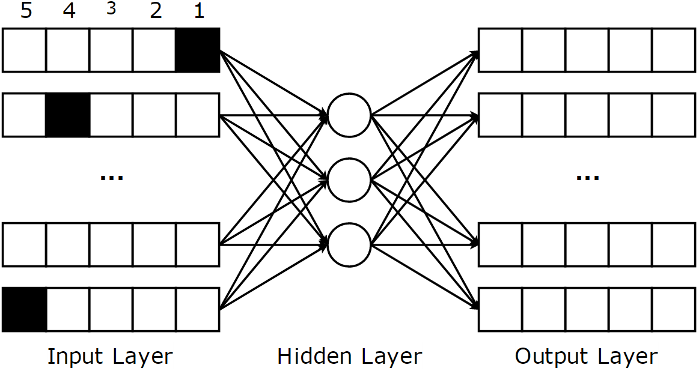

Source: https://arxiv.org/pdf/1707.07435.pdf

Author : saurabh jain
# DEEP LEARNING BASED RECOMMENDATION SYSTEM

## INTRODUCTION

**Information system -> Recommendation system;**

Recommendation system - filtering tool for guiding users in a personalized way of discovering products or services they might be interested  in from a large space of possible options.

**Application**

* sales and service promotional tool on apps and website .
* Netflix
* YouTube video recommendation
* App recommendation Google APP store
* Yahoo news (RNN BASED)

**Factors:**

1.  user preferences
1. item features
1. user-item past interactions
1. additional info. temporal or spatial data

**Limitations**

1. data sparsity
1. cold-start problems
1. balancing recommendation in terms of quality of different evaluation metrics.

**Why Deep Learning ?**

1. overcoming conventional models
1. achieving high recommendation quality
1. able to capture  non-linear and non-trivial relationships
1. enable codification of complex abstractions and data representations.

## TERMINOLOGIES AND BACKGROUND CONCEPTS

### Recommender System
used for estimating users preferences on items they have not seen

**Types of Recommendation task**

1. Rating prediction
    * aim to fill the missing entries of user-item ranking matrix.
1. Ranking prediction(Top N recommendation)
    * produce a ranked list with n item to users.
1. Classification
    * classifying into correct categories for recommendation.

**Types of Recommendation Model**

1. Collaborative Filtering
    * by learning from user-item historical interaction
        * explicitly by user's previous Ratings
        * implicit feedback ( browsing histories).

1. Content Based Filtering
    * based on comparisons across items' and users' auxiliary information.
        * texts.
        * images.
        * videos.
1. Hybrid Recommender
    * combination of two or more types of rec. strategies.

**Notations**

### Deep Learning Techniques
* Multilayer Perceptron (MLP)
    * Feed-Forward NN (FFNN) with hidden layers and arbitrary activation functions.
    * can model the non linear interactions b/w users and items.
* AutoEncoder (AE)
    * unsupervised model to reconstruct its input data in output layer.
    * bottle-neck-layer(the middle most layer ) as salient feature
    representations of the input data.
    * e.g. denoising AE , Marginalized AE
* Convolutional Neural Network (CNN)
    * special type of FFNN with Convolution layers and pooling operations.
    * capable of capturing global and local features from heterogeneous data sources such textual and visual information.
    * enhances efficiency and accuracy.

* Recurrent Neural Network (RNN)
    * suitable for modelling sequential data .
    * loops and memory to remember former computations.
    * to model the temporal dynamics of rating data and sequential influence of content information.
    * variants:
        * Long-short term memory(LSTM)
        * Gated Recurrent Unit (GRU)
    * overcome vanishing gradient problem
        * slow training at early layers of Deep NN ( near input layers) because gradient approaches close to zero.
        * increases training time
        * Hinton Lecon Bengio overcome VGP.

* Deep Semantic Similarity Model (DSSM)/ Deep Structured semantic Model
    * for learning semantic representations of entities in a  common continuous semantic space and measuring their similarities.
    semantic matching b/w users and items.

* Restricted Boltzmann Machine (RBM)
    * two layer NN: Visible and hidden layer
    * easily stacked to a deep net.
    * Restricted mean no intra-layer communication in visible layer or hidden layer.

* Neural Autoregressive Distribution Estimation (NADE)
    * unsupervised NN built atom Auto Autoregressive model and FFN.
    * tractable and efficient estimator for modelling data Distribution and densities.

* Generative Adversarial Network (GAN)
    * generative NN consists for generator and discriminator.
    * two NN trained simultaneously by competing each other in a minimax game framework.

## CLASSIFICATION SCHEME AND ANALYSIS

### Two-Dimension Classification scheme

**Neural Network model**
* Single Deep Learning Technique
    * All eight mentioned techniques: MLP AE CNN RNN DSSM RBM NADE and GAN.

* Deep Composite Model
    * more than one DL techniques.
    * different technique can complement one another to get hybrid model
    * deep composite model is different from hybrid deep Networks

**Integration Model**

1. Integrate DL  with Traditional RS
    1. some traditional recommendation techniques
        * matrix factorization (MF)
        * probabilistic matrix factorization(PMF)
        * factorization machine (FM)
        * nearest neighbors algorithm (NN)
    1. further division:
        1. Loosely Coupled model
            * e.g. AE with latent  factor model when both parameter of AE and latent factor model are optimized simultaneously.
            *  they mutually  influence each other.
        1. Tightly Coupled model
            * e.g. if parameters are learned separately.
1. Recommend Rely Solely on DL
    * training and prediction step of recommender solely
    rely on DL without any form of help of Traditional RS.

### Qualitative  Analysis

**Publications( 2.a,2.b and table 2)**
* most studied RS on AE, RNN, CNN and MLP
* then deep composite models, RBM and DSSM based models.
* recently GAN and NADE

**Datasets(2.c)**
* Movielens
* Netflix
* other Amazon, Yelp citeUlike
https://grouplens.org/datasets/movielens/
http://jmcauley.ucsd.edu/data/amazon/links.html
https://www.yelp.com/dataset_challenge
http://www.citeulike.org/faq/data.adp

**Evaluation metrics**

* For Rating prediction
    * Root mean Square Error(RMSE)
    * Mean Average Error (MAE)
* evaluating Ranking scores
    * precision
    * Recall
    * Normalized Discounted Cumulative  Gain(NDGC)
    * Area under the curve(AUC)
* Precision Recall and F1 score widely used for classification result evaluation.

** Most influential publications(yearly citation >10)**

**popular area in Recommendation task**
* Ranking Predication (66%)
* Rating prediction (28%)
* classification task (6%)

### Application Fields

## DEEP LEARNING BASED RECOMMENDER SYSTEM

### 1. Multi Layer Perceptron  Recommender System
[12,17]
#### 1. Recommend Rely Solely on MLP

##### 1. Neural Collaborative Filtering NCF* (READ IT/ COMPLETE IT)
* Two way interaction b/w user and item features.
* matrix factorization decomposes rating matrix to low dimensional latent user space  and latent item space.

* traditional content based RS generation recommendation list based on similarities b/w user profiles and item features.

* Aim to capture non linear relationship b/w user and items.

* NCF utilizes negative sampling to reduce the training data size, which greatly improves the learning efficiency (HOW ?)

* fuse matrix factorization with NCF to formulate general models   
    * use of linearity of MF
    * non-linearity of MLP

**Extensions**

??READ IT??    
Xiang Wang, Xiangnan He, Liqiang Nie, and Tat-Seng Chua. 2017. Item Silk Road: Recommending Items from Information Domains to
Social Users. Proceedings of the 40th International ACM SIGIR conference on Research and
Development in Information Retrieval (2017).

* cross-domain social recommendation. items to potential users of social network
* neural social Collaborative ranking RS.
* another extension CCCFNet(Cross-Domain Content-boosted Collaborative Filtering NN)    (Figure 3 b)
    * dual network for user and item.
    * models user-item interactions in last layer with dot product.
    * embed content Information each network divide to:
        * Collaborative filtering factor(user-item latent factor)
        * content-information (user's preferences on item features )
    * a multi view neural framework on basic model to perform  cross-domain recommendation.

##### 2. Wide and Deep Learning

* can solve both regression and classification
* App recommendation google play store.
* wide learning component(LEFT) is single layer perceptron (for generalized linear model0)
* deep learning component(Right) is MLP.
* combine two techniques  to capture both generalization and memorization.
* memorization by wide learning comp. capable of catching direct feature from historical data.
* DL comp. capture generalization by producing more general and abstract representations.
* improves diversity of recommendation

**Maths**

 ** Extensions **
 chen et al [9]

 * a locally connected wide &DL model
 * large scale recommendation task.
 * employs efficient locally-connected to replace DL comp.
 *  decreased running time by order of magnitude.

** Drawback **
* cross-product transformation required to be manually designed.
* selecting features for wide and deep learning parts

???TO LEARN??? about Factorization machine

##### 3. Deep Factorization Machine

* end-to end model
* seamlessly integrate factorization machine and MLP.
* high order features by Deep NN
* low order interactions by factorization machine (FM)
* FM utilize addition and inner product to capture linear and pairwise interaction b/w features.
* MLP leverage non linear activation and deep structure to model high-order interactions.
* does not require tedious feature engineering.
* replace wide comp with FM

** Math **

#### 2.  Integrate MLP with Tradition Recommender System

##### 1. Attentive Collaborative filtering

* motivated by human visual attention.
*  only focus on specific part of visual input to understand and recognize.
* capable of filtering out uninformative features from raw input
* reduces side effect of noisy data
* The attention model is MLP consisting of Chen et al[10]:
    * **item level attention**
        * to select the most representative item to characterize user.
    * **component level attention**
        * to capture most informative feature from multimedia auxiliary info from each user.
* Alashakar et al.[12]
    * ?? Fill Details
* Cocington et al [17] YOUtube video recommendation
    * ?? Fill Details

### 2. AutoEncoder based Recommendation System

generally two ways to apply AutoEncoder in RS:

* using AE to learn lower-dimensional features representation at bottleneck layers
* filling the blanks of rating matrix directly in reconstruction layer.

#### 1 Recommnd Rely Solely on AutoEncoder

##### 1 AutoRec[90]

 * takes users partial vectors r(u)
 * or item partial vectors r(i) as input
 * aims to reconstruct them in output layer.
 * has two variants
    * Item-based AutoRec (I-AutoRec)
    * User-based AutoRec (U-AutoRec)
 * Figure 4a
    * input: r(i)
    * the reconstruction is

*  objective function optimized by L-BFGS alog.
* Important points:
    * I-AutoRec performs better than U-Autorec high variance in user partial vectors.
    * different combination of f(.) and  g(.) affects performance considerably
    * increasing hidden layer size  increase models expressive capacity.
    * adding more layer improves performance

##### 2 Collaborative Filtering Neural Network(CFN) [98,99]
 * extension of AutoRec
 

 * **Advantages**:
    * deploys denoising techniques to make CFN more robust.
    * use side info. such as user profile and item description to mitigate  sparsity and cold start influence.
 * Two type similar to AutoRec uses partial observed vectors
    * I-CFN
    * U-CFN
 * three widely used approaches to corrupt the input:
    * Gaussian noise
    * masking noise(deals better with missing element)
    * salt and paper noise

   * where si is side information, { ˜r(i), si }
      indicates the concatenation of ˜r(i) and si.
   * incorporating side information improves prediction, accuracy
   * and speed up training process and model robustness.

##### 3 Autoencoder-based Collaborative Filtering(ACF)
paper [82]
 * instead of using partially observed vectors, it decomposes them by integer rating
 * e.g. rating score  b/w [1-5]
    * each r(i) will be divided into 5 partial vectors.

 * black entries represents user gives 1 rating for item and 4 for item 2.
 * cost function aims at reducing mean squared error.
 * rating prediction by summarizing each entry of 5 vectors.
 * then scaled by max rating of K(5 in this case)
 * Uses Restricted Boltzmann Machine (RBM) to pretrain parameters and avoid local optimum.
 * Demarits:
    * fails to deal with non integer rating.
    * partial observed vector increases sparsity  leads to worst prediction accuracy.

##### 4 Collaborative Denoising Auto-Encoder (CDAE)

* above models designed for rating prediction CDAE is used for ranking prediction.

* inputs: partial observed implicit feedback rpref(u)
* the entry is 1 if users likes the movie otherwise 0.
* considered as a preference vector( users interest to items).

* CDAE updates its parameters using SGD

**AE based RS comparisions**

#### 2  Integrrate Autoencoder with Traditional RS
* Tightly coupled model learns parameter of AE and recommendation model simultaneously.
    * that provide AE to learn more semantic feats.
    * \- requires careful design and optimisation to avoid local optimum.
    * \+ feats and recommendation can be performed at once.
* Loosely couple model is performed in 2 steps:
    * learning salient feats via AE.
    * feeding these feats to RS.
    * \+ easily extended to advance models
    * \- require more training steps.

##### I. Tightly Coupled Model.

###### 1. Collaborative Deep learning (CDL).

* heirrchical Bayesian model
* integrates stacked denoising AutoEncoder(SDAE) into probabilistic matrix factorization.
* to combine DL and RS  a general Bayesian DL framework having two Tightly hinged components:
    * perception component(Deep NN)
    * task-specific component.
* ???? fill Details

* ?????

###### 2. Collaborative Deep Ranking (CDR).

* ????

###### 3. Deep Collaborative Filtering framework.

##### II. Loosely Coupled Model.

????

### 3. Convolutional Neural Network based Recommender System
* CNN is powerful in processing visual, textual and audio info.
* most CNN based RS utilize CNN for feats extraction.

#### 1 Recommendation Rely Solely on CNN.

##### Attention Based CNN
* attention based CNN.
* for hashtag recommndation as a multi -class classification problem.
* has global channel and local attention channel.
* ???

* [32] used to NN to learn feats representation from user and item review text and predict rating scores.

##### personalized CNN Tag Recommendation.

* ????

** I. Tightly Couple Model **

##### Deep Cooperation Neural Network(DeepCoNN)

* two parallel CNN to model user behavior and item properties from reviewed texts.
* use factorization machine in last layer to capture rating prediction.
* \+ alleviates the sparsity problems
* \+ enhances model interpretability by exploiting rich semantic representations of review texts
????

##### ConvMF.

* combines CNN with PMF in similar way as CDL.
* CNN to learn high level item representations
* ??? Fill maths

** II loosely Coupled Model **

##### CNN for Image feature Extraction.

### 4. Recurrent Neural Network based Recommender System

* RNN are suitable for coping with temporal dynamics of Ratings
* sequential features in RS.

#### 1 Recommend Rely Solely on RNN

##### Session-based Recommendation with RNN.
* unappreciated task due sparsity of training data.
????

- Wu et al.[128]
- ?????

##### Recurrent Recommender Network
- [127] non parametric recommendation model
- Capable of modelling seasonal evolutions of item and changes of user preference over time.
- Uses two LSTM  

- ????? Details
- Wu et al [126] improved

most text review enhanced Recommendation models

- 91 and 140

##### Neural Survival Recommender.

 - predict returning time of user and recommendation items.
 - LSTM to estimate returning time of costumer.
 - user's past session actions.

##### Attention based RNN.
- [64] hashtag recommendation.
 
- ???? Details

#### 2 Integrate RNN with Traditional Recommender System

##### GRU multitask learning

- Bansal et al [4]
    - solve both cold start and warm start problem
    - multi-task regularizer to prevent overfitting
    - alleviate sparsity of training data
    - main task is rating Predication
    - auxiliary task is meta data prediction
- Dai et al [19]
    - co-evolitionary latent model to capture nature of users' and items' latent features

- OKura et al [81]

 - use GRU to learn more expressive aggregation of user browsing histories
 - significant improvement compared with traditional word based approach.
 - system has been deployed in online production services

### Deep Semantic Sumilarity Model based RS

#### Deep Semantic Similarity model(DSSM)[46]

- supremely suitable for top n recoommendation
    -[26]
    -[132]
- different entities into common low-dimensional space,
- computes cosine similarity.
- uses MLP
- CNN and max pooling layers can be added.

#### Deep Semantic Similarity based personalized Recommendation(DSPR) [132]

- ?????

#### Multi-View Deep Neural Network(MV-DNN)[26]

-  Cross Domain recommendation.
- Assumption users having similar taste in one domain has similar taste in another
- must have some preliminary knowledge on the correlation across different domains.

### Resctricted Boltzmann Machine based RS

#### Restricted Boltzmann Machine Collaborative Filtering(RBM-CF)

- [89]
    - ?????

- [30] proposed to combine the use-based and item-based CF in a unified framework

#### Hybrid RBM-CF
    -Liu et al. [70]

### Emerging Mehtods: NADE and GAN
** NADE **
 - tractable method for approximating real Distribution of source data and produce state of art Recommendation accuracy and rating prediction.

** GAN **
- capable of fusing discriminative model with generative model together
and posses the advantages of these two schools of thinking

#### Neural AutoRegressive based RS
[142] CF-NADE
- is tractable Distribution estimator desirable alternative to RBM
-

#### Generative Adversarial Network based RS
IRGAN[116]
- capability in 3 IR tasks
    - web search
    - item recommendation
    - question answering

 - ???

 ## Deep Composite Model for Recommendation
 - Use combination of composite models
 - 8 C 2 combinations

### CNN AND AE

#### Collaborative knowledge based embedding (CKE)
- [137]
- CKE leverages
 - structural content
 - textual Content
 - visual Content with different embedding techniques.

### CNN And RNN
- Lee et al [58] for quote recommendation

- [138] for hashtag recommendation

### CNN AND MLP
- Lei et al. [59]

- ConTagNet [85] context-aware tag RS

### RNN and AutoEncoder
- more robust and capable of modelling sequnce of text info.
Wang et al
- ???

### RNN and MLP

#### NRT[61]

- can predicts Rating
- generate textual tips for user simultaneously.

### CNN and DSSM

Gao et Al [28]

### RNN and DSSM
Song et al.[97]
-

## Future Researc Direction and OPen Issues

### deep Understanding of Users and items
- Deep understanding of item characterize and user's real Demands
     - acheivable by exploiting auxiliary information.
        - context information according to user's surroundings
        - cold start
        - implicit feedback
    - explicit feedback is resource demanding task
    - Data from heterogeneous sources can be exploited
        - social network twitter of fb data.

- feature engineering
    - not fully researched

### deep composite models
- careful designed

### Temporal Dynamics
- session based RECOMMENDATION
- co-evolution of items and Users

### Cross Domain Recommendation

### mutl-Task Learning

- has 3 Advantages
    - avoid overfitting generalized shared hidden representations.
    - auxiliary task to provide interpretable output for explain recommendation.
    - alleviate sparsity problem

### Attention mechanism
    - noisy input processing.
    - helps RNN to better memorize.
    - capture most informative feats.
    - filter out uninformative content.
    - most representative items
    - provide good interpretability

### Scalability
- time complexity
- data required
- training time.

- Challenges
    - incremental LEARNING for non stationary and streamed data
    - large volume of incoming users and Items
    - Computational efficiency for high dimension.
    - exponential growth of parameter

### Novel Evaluation metrics
 - not only acurracy precision recall improvement
 - model should be
    - diverse
    - Novel
    - serendipity
    - coverage.
    - trustworthiness
    - privacy
    - interpretability
