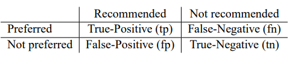
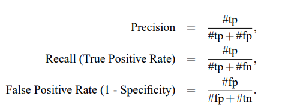

# Recommender System :  Losses

- Sigmoid on last layer 

### Binary Cross entropy 

### Categorical cross entropy 

### MSE 

### MAE 

# Recommender System : Metrics 

## Explicit Feedback (Rating Feedback)

### MAE ( Mean Absolute Error)

$\frac{\sum_{(i,j)\in K }  |p_{i,j}-t_{i,j}|}{n}$

### **MSE** (Mean Squared Error)

$\frac{\sum_{(i,j)\in K } (p_{i,j}-t_{i,j})^2}{n}$

### **RMSE** (Root mean Squared Error)

$\sqrt \frac{\sum_{(i,j)\in K } (p_{i,j}-t_{i,j})^2}{n}$

### **Precision@n**

### Recall

)

### F-Score

### F-Score ( Micro)

### ROC

### MAP**: Mean Average Precision

**nDCG**: normalized Discounted Cummulative Gain
J¨arvelin, K., Kek¨al¨ainen, J.: Cumulated gain-based evaluation of ir techniques. ACM Trans. Inf. Syst. 20, 422–446 (2002)

## **Diversity**

**Intra-list Similarity**
Ziegler, C.-N., McNee, S.M., Konstan, J.A., Lausen, G.: Improving recommendation lists through topic diversification. In: Proceedings of the 14th International Conference on World Wide Web, WWW 2005, pp. 22–32. ACM, New York (2005)

**Lathia's Diversity**
Lathia, N., Hailes, S., Capra, L., Amatriain, X.: Temporal diversity in recommender systems. In: Proceeding of the 33rd International ACMSIGIR Conference on Research and Development in Information Retrieval, SIGIR 2010, pp. 210–217. ACM, New York
(2010)

## **Implicit Feedback**

### **Mean Percentage Ranking**

Hu, Y., Koren, Y., Volinsky, C.: Collaborative filtering for implicit feedback datasets. In: Proceedings of the 2008 Eighth IEEE International Conference on Data Mining, pp. 263–272. IEEE Computer Society, Washington, DC (2008)

###**User-Centric Evaluation Frameworks**

Knijnenburg, B.P., Willemsen, M.C., Kobsa, A.: A pragmatic procedure to support the user-centric evaluation of recommender systems. In: Proceedings of the Fifth ACM Conference on Recommender Systems, RecSys 2011, pp. 321–324. ACM, New York (2011)Pu, P., Chen, L., Hu, 