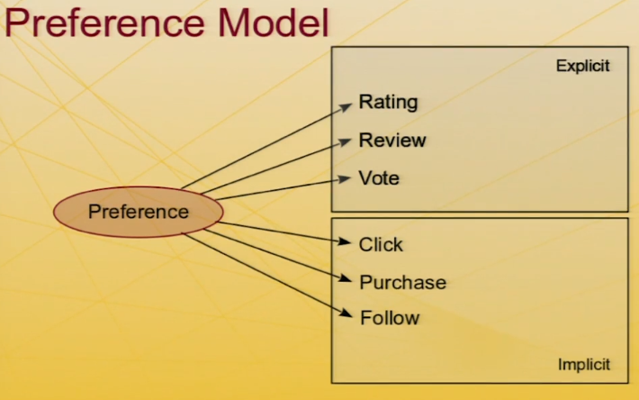
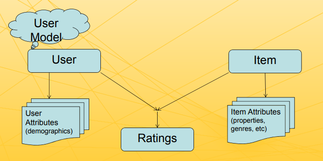
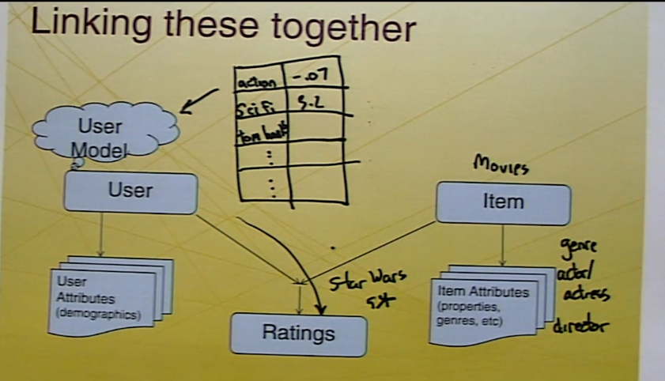
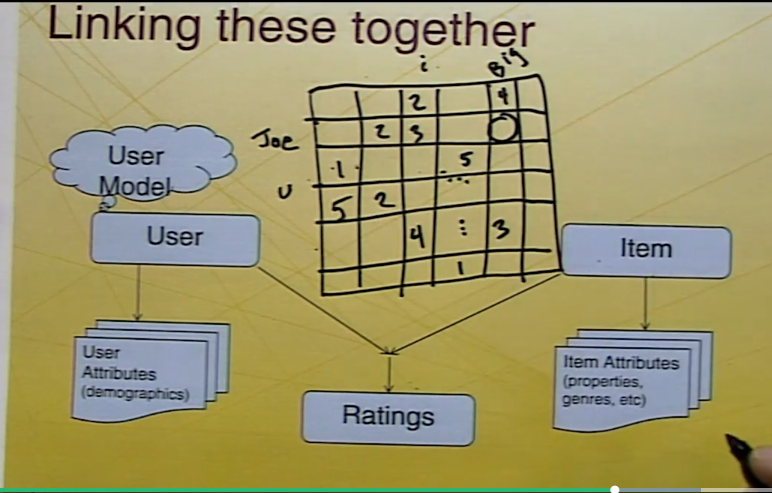

# Week 1
## Introduction
- example of ants finding food/cavemen.

### Information Retrival.
- Static content Base
    - new books and webpages are rare.
    - some information of item does change that frequently.
    - invested time in indexing content on different categories.
        - catalog library, ex book by author ,topic, year etc.		
- Dynamic information need
	- Queries presented in real time.
- Common approach: TFIDF
	- Ranks documents by term overlap. 
	- Ranks terms by frequency.

with time streams of information rapidly changing for ex: new email, new article, post, news, pages.

### Information Filtering
- Reverse assumption from IR
    - information needed here  is static.
    - but Dynamic content base.
    - ex: I want most relevant blog RecSys.
- Invest effors in modeling user need
    - Hand created profiles.
    - Machine learned profiles.
    - Feedback/updates/preferences.
- Pass new content through filters.

### Collaborative Filtering (Manual)
- Premise
	- Goal: good quality relavant retrival on that topic
	- Information needs more complex than keywords or topics: quality and taste.
- Small community: Manual
	- Tapestry
		- database of contents and comments.
	- Active CF
		- forming distribution group of similar taste, region etc.
		- easy mechanism for forwarding content to relevant readers.

This lead to idea of 
### Automated Collaboration Filtering(ACF)
- The GroupLens Project
-  ACF for UseNet News
	- users rate items
	- users are correlated with other users.(similar taste)
	- personal prediction for unrated items.
- Nearest neighbour approach
	- find people with history of Agreement.
	- assumes stable tastes
- **It worked well**
	- Significantly more accurate than predicting average or modal rating
	- Higher accuracy when partitioned by newsgroup.
	- Relationship with User behaviour
		- Twice as likely to read 4/5 rated than 1-3 rated new

### Classic Collaborating filtering

- users assign rating to items and stored in database.
- mines database to find correlation among users.
- one user request recommendation then find the neighbourhood of that user
- recommends items depends upon neighbours opinions.
- this user rate after he has found relavent item.(Feedback)

### Recommender 
- Are tools to help identify worthwhile stuff to people.
- Breakdown by interface.
	- filtering interfaces
		- E-mail Filters, Clipping services
	- Recommendation interface.
		- Suggesting lists, Top-N offers or promotions
	- Prediction interface.
		- Evaluated candidate, predicted ratings/score.
### A Little vocabulary
- Ratings- expression of preference.
  - Explicit Ratings: user rated the item, 
    - ex: I like the movie very much and give it 4 star.
  - Implicit Ratings: with users action/behaviour ratings are derived  
    - I stopped watch the YouTube video/ movie in middle.
- Prediction - estimate of users preference (how much user will like).
- Recommendation - selected item for user ( one or more items for users)
- Content - attributes, texts/content(tags, meta information) in or about the article/new/movies etc.
- Collaborative - using data from other users.(what else user like to buy/read)

### Recommendation Approaches

- Non-personalized And Stereotyped
  - Popularity, Group Preference
  - age-groups, regions, population groups etc. 
- Product Association
  - If people like item A also like item B then recommend B also.
  -  people who buy Tea people also likes to buy Biscuits.
- Content- Based
  - Learn what I like (in terms of attributes)
- Collaborative
  - Learn what I like; user others' experience to recommend.

### Designing a Recommender

- Collecting Opinions/ Consumer behaviors and Experiences Data or Demographics
- Finding the Relevant Data for a purpose and present  
- Computing the Recommendations
- Presenting the Data in a Useful Way

### Recommenders as Big-Data

- Heavy Emphasis on Analysis and Evaluation 
  - Exploring Data to Determine Best Recommendation Approaches 
  - Algorithms Optimize Performance Against Metrics 
  - Metrics Designed to Improve User Experience and Business Goals 
- Continuing Adoption of New Machine Learning Techniques. 

## MovieLens Tour

## Preference and Ratings

- To recommend we need Data
  - what user like
  - which goes together
- **objective**
  - understand what data can be use to  learn what users like
  - identify types of data collected from user
  - understand what different data types are possible and appropriate.
  - able to identify types of preference data likely used in a system.

### Preference Model

#### Explicit Rating

* **Ratings** :asking explicitly to user for rating  and review
  * 5/7/10 star integer/decimal/half star
  * provide  meaning/calibration what each star rating means
* **Thumbs and likes**
  * up/down
  * like +1
  * these ranking are common for items that does not very long time span
    * new aggregation , Q&A , YouTube videos.
  * Very low cost to rate.
* **Other interfaces**
  * continuous scales
  * Pairwise/comparisons preferences 
  * Hybrid(never play the song again)
  * Temporary(e.g. suspend for 30-days)

* **when are ratings provided?**
  * Consumption
    *  during or immediately after experiencing the item.
    * YouTube video right after watching it. 
  * Memory 
    * some time after experience 
    * Movie rated after they watch.
  * Expectation 
    * the item has not been experienced/consumed.
    * possible for high Cost low items.
      *  houses, cars, hotels.
    * Item description to be accurate.
  * Joke Rating/sarcastic Rating
* **Difficulties with Rating**
  * Are rating reliable and accurate?
    * rating shift with time
  * Do user preference change?
  * what does a rating mean?

#### Implicit Data

* Data collected from user action .
  * amazon knowing what is purchase 
  * what type pizza I generally like based on  my order history.
* Key difference: user action is for some other purpose, not expressing preference 
* Their actions say a lot
* **Reading Time**
  * Early implicit data: how long did user read/watch/listening.
* **Binary action**
  * Click on link(ad, result, cross-reference).
  * Don't click on link
  * Purchase
  * Follow/Friend
* **subtleties and Difficulties** dealing with data
* What does the action mean? 
  * Purchase: they might still hate it 
  * Don't click: expect bad, or didn't see 
* How to scale/represent actions? one or more click 
* Lots of opportunity to be creepy 
  * Education may help 
  * So can respecting privacy 

### Conclusion

- Recommenders mine what users say and what they do to learn preferences 
- Ratings provide explicit expressions of preference 
- Implicit data benefits from **greater volume**.

## Prediction and Recommendation

### Learning Objectives 

- To understand the ways in which recommender output can be used 
-  To understand the distinction between predictions and recommendations 
- To understand the distinction between organic and explicit presentation 
- To review examples and understand which presentation makes most sense in different applications.  

### Prediction

- Estimates of how much you’ll like an item 
- Often scaled to match some rating scale 
-  Often tied to search or browsing for specific products 
- Coursera measures +1, #fb likes,# Tweet
- Movielens: in the form of stars.

### Recommendation

- Prediction are general suggestion for the search that might be 5 star for some but not for you this way u may loose the trust in the system

- Recommendations are suggestions for items you might like (or might fit what you’re doing)
  - Often presented in the form of “top-n lists” 
  - Also sometimes just placed in front of y 
  - does not give me chance/probability the suggestion.
- e.g. show movies from 2002 English Sci-Fi don't show Prediction/ratings.
- e.g. Top selling  budget phones/ selling phones 
- you might be interested in the recommendation.

### Prediction and Recommendation

- Often, they two come together 
- Predictions: 
  - Pro: helps quantify item,gives a clear understanding one scale. 
  - Con: provides something falsifiable , can be something wrong
    - 4.5 stars it says but it is not after buying or watching.
- Recommendations 
  - Pro: provides good choices as a default  
  - Con: if perceived as top-n, can result in failure to explore (if top few seem poor)
    - if they don't find relevant items on first page they stop looking .
- **Predictions estimate a person’s rating (or liking/consumption) of an item; recommendations select items for the person from a larger set.**

### Another dimension

- How explicit is the prediction or recommendation (vs. organic)? 
  - explicit Prediction: here are something/offers/item/music/movies just for you.
    - Pros: Attention Seeking
    - Cons: Customer thought they are being manipulated (lost Trust) feel Pushing.
  - organic Prediction:
    - something that is soft  position interesting things in some best places on the website or book shelf not pitched directly.
    - best seller in the category.
    - like prime assured.
    - discount available on items.
    - you might like this 
    - e.g. Pandora is designed to fit in not to overwhelm the listening experience with "in your-face recommendations."
- Historical note: we paid for it, we’ll let you know 
- Today: balance between explicit prediction (falsifiable) and coarser granularity (you might like this!) 
- Today: balance between theses are the best (top-n) and softer presentation (here are some that might be interesting) 

## Taxonomy of Recommenders I

 ### Analytical Framework 

- Dimensions of Analysis 
  - Domain 
  - Purpose 
  - Recommendation Context 
  - Whose Opinions 
  - Personalization Level 
  - Privacy and Trustworthiness 
  - Interfaces 
  - Recommendation Algorithms 

### 1. Domain of Recommendation

- Content to Commerce and Beyond 
  -  News, information, “text” 
  - Products, vendors, bundles(Deal: buy  x+y ) 
  - Matchmaking (other people) 
  - Sequences (e.g., music playlists) (order of songs) 
- One particularly interesting property 
  -  New items (e.g., movies, books, …) in some Domains 
  - Re-recommend old ones (e.g., groceries, music)  experience before.

#### Examples

- Google Recommending webpages.
  - sponsored Ads
- Hammacher Schlemmer
  - similar type of games.(not accessories for product an alternative.)

### 2.  Purposes of Recommendation (2nd Dimension)

- The recommendations themselves 
  - Sales 
  - Information 
- Education of user/customer (Recommendation for education)
- Build a community of users/customers around products or content 
- e.g. OWL Tips
  - education purpose about the UI some shortcuts/Useful tips and commands or code etc.
- tripadvisor 
  - Recommendation score in stars.
  - goal is to 
    - educate us to make right decision.
    - try to build a community to become tripadvisor
- ReferralWeb
  - Recommendation tied to expertise finder
  - mine the work of collaborators 
  - finding experts close to you in social graph on particular field.
  - facebookGraph etc.

### 3. Recommendation Context  

- What is the User doing at the time of recommendation? 

  - Shopping 
  - Listening to Music 
    - then it can avoid recommending new song after every song
    - or might change the order of playlist
    - sometimes might add some new songs that I would like to listen 
  - Hanging out with other people 
    - may make recommendation for group
  - e.g. **Pandora**

- How does the context constrain the recommender? 

  - Groups, automatic consumption (vs. suggestion), level of attention, level of interruption?  

  

### 4. Whose Opinion? 

RS based on somebody opinions

- “Experts” 

- Ordinary “phoaks” 

- People like you 

- e.g. wine.com

  - description about wine by experts for other people.

- e.g. PHOKS

  - most popular /recent new pages

  

### 5. Personalization Level 

- Generic / Non-Personalized 

  - Everyone receives same recommendations 

- Demographic 

  - Matches a target group 
  - age/gender etc.

- Ephemeral 

  - Matches current activity (not long term interest)
  - current search for a item. 

- Persistent 

  - Matches long-term interests 

- e.g. Landsend

- BrooksBrothers 

- CDNOW

  - ephemeral

  

### 6. Privacy and Trustworthiness

- Who knows what about me?

  - Personal information revealed (how much info)
  - Identity 
  - Deniability of preferences 
  - Can I use anonymously.
  - Data or personal info security.

- Is the recommendation honest? 

  - Biases built-in by operator 
    - “business rules” 
    - never recommends out of stock or out of size (appreciate)

  - Vulnerability to external manipulation 
    - very high score initially flood high star for new items.
    - wait for some people to review.
  - Transparency of “recommenders”; Reputation 

### 7. Interfaces

- Types of Output 
  - Predictions of specific score
  - Recommendations of items
  - Filtering a search list
  - Organic vs. explicit presentation 
    -  Agent/Discussion Interface 
- Types of Input 
  - Explicit 
  - Implicit 

### Recommendation Algorithms 

- Non-Personalized Summary Statistics 
- Content- Based Filtering 
  - Information Filtering 
  - Knowledge-Based 
- Collaborative Filtering 
  - User-User 
  - Item-Item 
  - Dimensionality Reduction 
- Others 
  - Critique / Interview Based Recommendations 
  - Hybrid Techniques 

## Taxonomy of Recommenders II

### From the Abstract to the Specific 

- Basic Model 
  - Users 
    - are people in system have preferences for items	 
  - Items  
    - item chosen to recommend.
  - Ratings  
    - expressed opinion
  - (Community) 
    - User and Item and together as community

### Linking these together

- User model

  - preferences or wish-list.

  

### Non-Personalized Summary Stats

- External Community Data 
  - Best-seller; Most popular; Trending Hot 
- Summary of Community Ratings 
  - Best-liked 
- Examples
  -  Zagat restaurant ratings 
  -  Billboard music rankings 
  -  TripAdvisor hotel ratings 
    - Do no need User Models.

### Conten-Based Filtering

- User Ratings x Item Attributes => Model 

- Model applied to new items via attributes 

- Alternative: knowledge-based 
  - Item attributes form model of item space 
  - Users navigate/browse that space 

- Examples 
  - Personalized news feeds ( do not require or wait for Rating)
  - Artist or Genre music feeds 

- Movies

  - movie will have some important properties
    - genre/actors/director
  - when movie is rated
  - User model is updated properties of model
    - update the taste vector of user.
  - new movies is than matched with user model.
  - calculate stronger or behavior  model

  

### Personalized Collaborative Filtering

- Use **opinions of others people**  to predict/recommend 

- User model 

  - set of ratings 

- Item model 

  - set of ratings 

- Common core: sparse matrix of ratings

  - Fill in missing values (predict) 
  -  Select promising cells  (recommend) 
  - many items/books/movie
  - very less user rating

- Several different techniques 

  

### Collaborative Filtering Techniques

- User-user 
  -  Select neighborhood of similar-taste people 
    - **Variant:** select people you know/trust or in social n/w
  - Use their opinions 
-  Item-item 
  - Pre-compute similarity among items via ratings 
  - Use own ratings to triangulate for recommendations 
- Dimensionality reduction
  - Intuition: taste yields a lower-dimensionality matrix 
  - Compress and use a taste representation 
  - user as set of taste numbers
  - every movie as set of taste numbers.

### Note on Evaluation 

- To properly understand relative merits of each approach, we will spend significant time on evaluation 
- Accuracy of predictions 
- Usefulness of recommendations
  - Correctness 
  - Non-obviousness 
  - Diversity 
- Computational performance 

### Other Approaches  

- Interactive recommenders 
  - Critique-based, dialog-based
  - ask question in order to under user taste.
- Hybrids of various technique 

## Tour of Amazon

we will look at website on dimensions

### experiment1

- based on your shopping trends
  - may be based on my purchase.
- items have purchase before - repurchasing.
- Recommendation for me
  - mostly phone or electronic gadget of accessories.
  - recently viewed items.
- After personal recommendation
  - buy it again
- Dimensions of Analysis 
  - **Domain**: products already purchase 
  - **Purpose** : to get user to re-buy.
  - **Recommendation Context**: general browsing. (not specific item browsing) 
  - **Whose Opinions** : opinion dependent directly of user's implicit data.
  - **Personalization Level** : personalized. (one product at a time)
  - **Privacy and Trustworthiness**: this is data we expect them to have (not shared with others) 
  - **Interfaces** : cluster suggestion
  - **Recommendation Algorithms**: we can speculate
    - commonly depleted (used-up)
    - items that are profitable 
    - may be purchase cycle.

### experiment 2 

**customer who bought this also bought this after selecting a item(pen) in this case .**

Dimensions of Analysis 

- **Domain: ** product
- **Purpose**: add on sales, people who bought this also bought this.
- **Recommendation Context**: shopping for product
- **Whose Opinions** : other shopper who also bough this
- **Personalization Level**: ephemeral personalized based only on the current product.
- **Privacy and Trustworthiness** 
- **Interfaces** : set of recommendation.
- **Recommendation Algorithms** : product association algorithm

### experiment 3	 

- product related to this (sponsored product)
- customer view this item also viewed
  - likely  alternatives.
  - people eventually bought these products looking for selected product
- After add this card
  - same recommendation that are bought with the current item
- back to my amazon.com recommendation for you changed.
- producing reasonable explanation  for recommended items
- **Domain**: product
- **Purpose** : general recommendation to purchase.
- **Recommendation Context**: as requested
- **Whose Opinions** : other customer + me
- **Personalization Level**: personalized to my history/ owned / gifts etc.
- **Privacy and Trustworthiness** 
- **Interfaces** : list of recs
- **Recommendation Algorithms** : collaborative + content based possible

## Recommender System Past,Present and Future

### Before “Recommender Systems” 

- Manual Personalization(old idea)
  - hire agent to find things , travel agents, or wardrobe agent.
  - personal shoppers.
- Cross‐Sales and Early Product Associations(very old idea)
  - early data mining or statistics.
  - Tea with biscuits.
- Product Search( not very old)
  -   personalized search

### The Early Days 

- 1992‐1996 (Collaborative Filtering Nearest-neighbor)
  - Research:  GroupLens, RINGO, Video Recommender, and more 
  - Industry Developments:  Amazon and Beyond
    - data driven discovery. 
  - Early Commercialization:  Agents, Inc., Net Perceptions, and many more … 
  - Mix of Business Excitement and Altruistic Dreams 

### The Tech Bubble and the Burst 

- Recommendation as key technology … 
  - rapid ascent
- And then, Recommendation in Context 
  - rapid cooling

### Wave Two:  The Netflix Prize 

- New Excitement in Recommender Systems 
  - Netflix $1,000,000 prize 
  - Recommendation as an application area for data mining, machine learning 
  - Rapid Growth in the Field 
- New Techniques 
  - Algorithm Stacking 

    - best of each techniques - clever hybrid

  - New Matrix Factorization Techniques 

    

### Mature Realizations 

- Prediction and Basic Top‐N Algorithms Limited 
  - Magic barriers
    - can recommend accurate than people can rate better 
  - Value of Recommendation 
  - Context, Content, much more … 
    - where, when, with whom?

###State of the Field Today  

- Algorithms Well‐Known 
- Effective Recommendation Still a Craft 
  - Exploring Data 
  - Understanding Usage Cases and Value Proposition 
- Still Largely Focused on Business Applications 
  - Immense Creativity 
  - Dream of Consumer- Owned not Realized 

###Looking Forward

- Many Hard Problems Unsolved
  - Temporal Recommendation 
  - Recommendations for Education
    - what next lesson or version of lesson 
  - Low‐Frequency, High‐Stakes Recommendations
    - house or doctors,surgeon 
- Recognized Specialty that Brings Together 
  - Machine Learning / Data Mining 
  - Business / Marketing 
  - Human‐Computer Interaction / Understanding 

### Promising Directions 

- Context, Context, Context … 
- Sequences of all types 
  - Music 
  - Education 
- Lifetime Value (when do we exploit something we know)
  - Includes exploit vs. explore … 