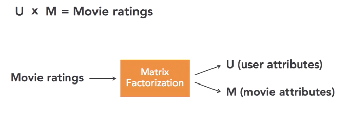

**some useful pandas functions**

- pivot table (make sparse table)

# Collaborative Filtering with Matrix Factorization

- user attributes as user latent  representation (U)
- and item attributes as item latent representation (M)
- and ratings are product of those latent representations
- **R = U X M**

## Building a RecSys

1. Create a matrix of known user reviews

2. Factor out a U (user attr.) matrix and an M (movie attr.) from the Known reviews.

3.  Multiply the U and M matrices we found to get review scores for every user and every movies

4. Catch we don't know the U and M attributes.

5.  because of this U and M are called Latent Vectors (hidden representation

6.  In code used low rank factorization of Rating  Matrix to get user and Movie latent vectors.( some what like SVD )

   

## Matrix Factorization

### Assuming

1. We have a large matrix of number

2.  we want to  satisfy the rule:

    small matrix 1 x small matrix 2 = Large matrix

3. **Goal**: Find those two small matrix 

### Calculating a Matrix Factorization(MF)

- Standard MF approaches won't work bcoz matrix has missing values.
-  Instead, MF is done using iterative algo.

### Estimating a MF

- step1:
  - set all U and M to  random number
- step2 :
  - Create a "cost function "  that checks how far off U x M  currently is from equaling the known value of the rating matrix.
- step3 :
  - Using a numerical optimization algorithm, tweak the numbers in U and M a little at a time . The goal is to get the "cost function" a little closer to zeros.
  - scipy **fmin_cg()**
- step 4:
  - Repeat step 3 until we can't reduce the cost function further.

## user or  Product Similarity

- latent representation of the user or product can be used to find product or user similarity 

### RMSE

- RMSE is a measurement of the  difference b/w the user's real rating and predicted rating
- The lower the RMS, the more accurate the model.

## Handling  First-time Users/ Cold Start Problem

1. Do not make any recommendations.

2. Recommend based on product similarity

3. Recommend based on overall average ratings.

   

