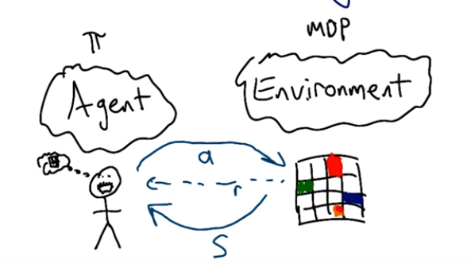

#Reinforcement Learning Basics

agent does not know the environment  it knows the environment with the help of interactions with it. and can build model at its it side.    

agent also does not know what action does what (initially)

agent also does not know what is the goal

## Behavior Structures

kind of behavior

**plan**

- fixed sequence of actions
- works for deterministic environment
- problems:
  - during learning we don't know stuff
  - stochasticity

**conditional plan**

- plan with if statements

**stationary policy/universal plan**

- mapping from state to action
- handle stochasticity
- if at every state same if statement
- very large difficult to store/handle
- very powerful
- always optimal stationary policy exist.

## Evaluation a Learner

- Value of returned policy

- policy that reach goal quickly(time)

- computation complexity(time)

  - how quickly it learn.

- experience/Sample complexity(time)

  - how much data it needs

- space complexity
