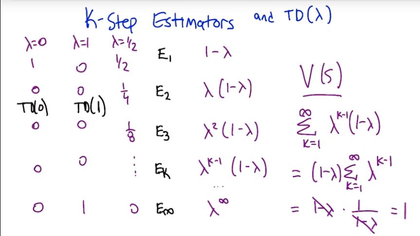
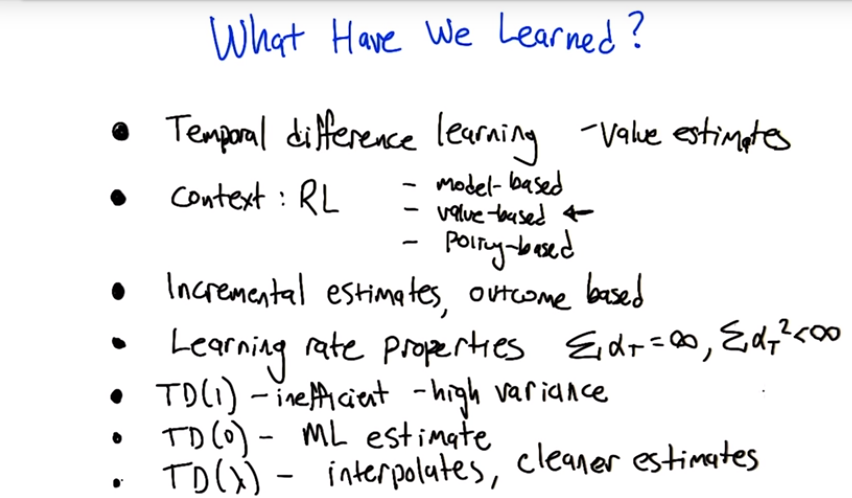

# Temporal Difference Learning(TDL)

## RL context

$<S,a,r>^* \rightarrow RL\ algorithm -> \pi$

- we are given sequence of state action reward to RL algorithms to find out best policy

## RL algorithms families

- **model Based**
  -  first learn model learner learns transition and reward
  - and then forward it to MDP solver which produces optimal value function
  - from value function we can get a policy
  - it takes history and also take current estimate of transition and reward
- **Value-function based/ Model Free** (course Focused)
  - we have direct value update equation to generate Q
  - then Q to generate policy
- **policy Search**
  - learning problem is very difficult
  - feedback is not very useful for directly modifying the policy

## TD Lambda $TD(\lambda)$

learn to make prediction that place overtime

$V_T(S_1) = V_{T-1}(S_1) + \alpha ( R_T(S_1) - V_{T-1}(S_1)) $

- just like update rule of perceptron.

**Properties of learning rate:**

- This algorithm will converge when:
- $\underset{ T\rightarrow \infin}{lim} V_T(s) = V(s)$  for large value of T and also
  - $\sum_{T}{\alpha_T>\infin}$
  - $\sum_{T}{\alpha_T^2 < \infin}$

## TD(1) Rule

At Episode T

- For all s, e(s)=0 (eligibility) at the start of episode, and  $V_T(s) = V_{T-1}(S)$
- After $S_{t-1} \rightarrow^{R_{T}} S_t$ : (step t within episode T)
  - $e(s_{t-1}) = e(S_{t-1})+1$ (update eligibility)
- For all **S**,
  - update temporal difference
    - $V_T(S) = V_{T}(S)+ \alpha_T (r_t + \gamma V_{T-1}(S_t)- V_{T-1}(S_{t-1}))e(S)$
  - $e(S) = \gamma e(S)$
- **Claim:** TD(1) is the same as outcome-based updates (if no repeated states)
- If there are repeated states than it is ignoring anything learned  along the way During the episode.
- TD(1) is looking at individual runs not all the data , It could happen you may stay on an estimate that is quite far off for the long time.
- where as maximum likelihood used the all the data available
- suffer from high variance problem. example driven noise driven

## TD(0) Rule

Finds the Maximum Likelihood estimate ( if finite data repeated infinite often)

## TD($\lambda$) Rule

TD lambda is weighted combination of different step estimators

TD(0) is one step look ahead .

### K-step estimator

TD($\lambda $) gives advantage of both

- rapidly propagating the information TD(1)

- also we do not get a biased estimate. TD(0)

## summary

