# Setting up your Machine Learning Application

## Train/Dev/ Tests sets

Applied Deep Learning is highly iterative process

- \# layers
- \# hidden layers
- learning rate
- activation functions
- **Application Domain:** NLP, Vision, Speech, Structural Data (ads, search, security, logistics)

###Division

- training-set = 70%
- validation/development -set = 15%
- Test-set = 15% (around > 1000 examples)
- you may user 60-20-20
- As data increases we may choose small dev set

### Mismatched train/test distribution

- train-test distribution must be from same dataset
  - e.g. very high image data from the web
  - for testing  low resolution image uploaded by users are used.
- Make sure Dev and test  come from the same distribution.
- Not having a test set might be okay. (according to A.NG)

## Bias/Variance

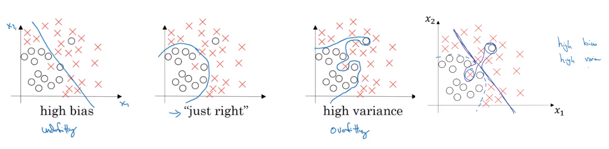

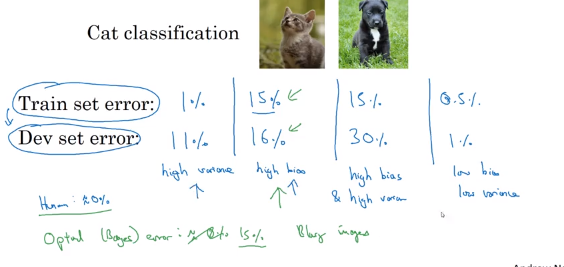

## Basic recipe for ML-DL

### High bias?

- look at training data  performance
- try bigger network 
- try to train for more iteration
- NN architecture search
- getting more data is not going to help

### High Variance? 

- look at dev set performance
- more data
- regularization
- find NN architecture search

## Regularization

- regularization  works as a weight decay 

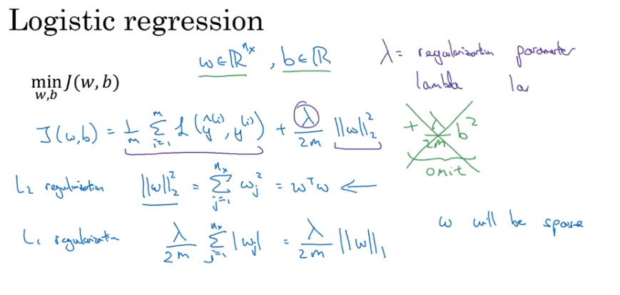

- square norm of vector
- Frobenius norm for matrix weight matrix

- weight is multiplied by a quantity less than one thus it is called **weight decay** .
- searching over optimal value for lambda make is more expensive.

## Why Regularization works

when lambda is high most of the weights values are close to zero thus only few hidden units are active thus NN is high- biased and work similar to logistic regression. or simpler network

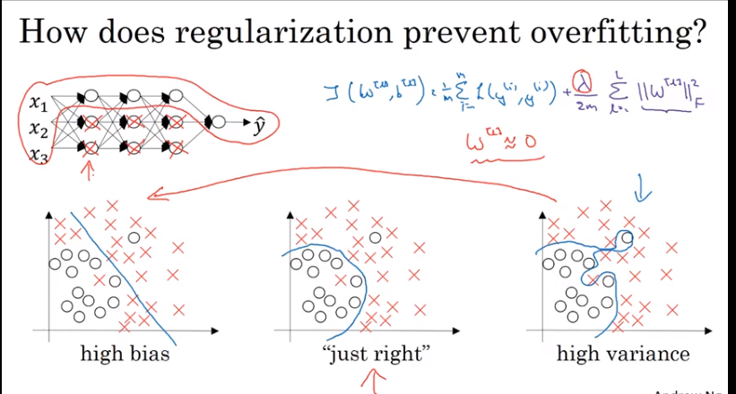

- suppose we are using Tanh 
- if regularization parameter   is high w will take small range of value 
- activation function will be approximate linear thus network as whole will be itself linear function
- thus it will be similar to logistic regression/ linear regression does not capture non linearity.
- **Implementation tip**:  
  - plot cost J as #iteration.
  - if using regularization used add regularization term to the cost function J.

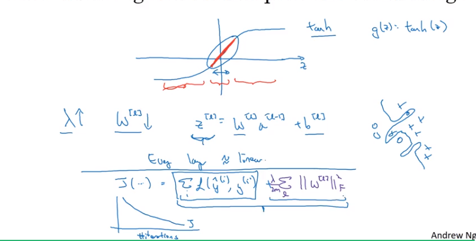

## Dropout

- killing nodes at random in the hidden layers 
- 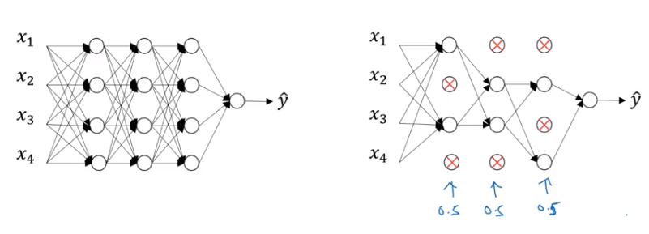

### Dropout Implementation("Inverted Dropout")

- multiply element by keep matrix ( having Boolean matrix)
- green line is inverted dropout divide by keep_prob
- for different examples drop different set of hidden units.
- not use dropout at test time.
- 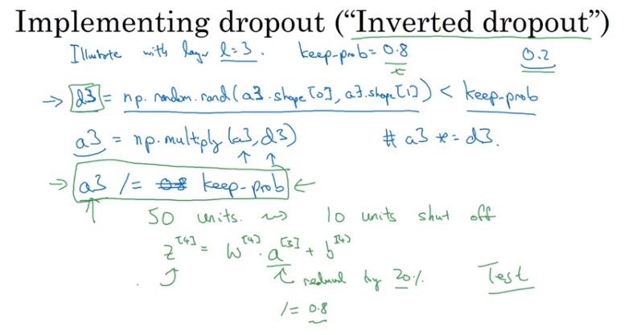

### Understanding Dropout

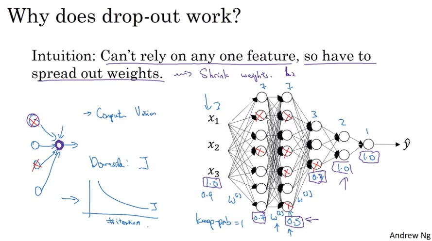

- drop has similar effect as regularization
- different keep_probs for different layers
  - lower keep_probs for dense layers 
  - can apply keep_prob for input layer also but keep it close to 0.9-1.0.
- problem : we have to manage more hyperparameters.
- dropout used mostly used in computer vision.
  - does not always have enough data 
- problem : cost function is  no longer well defined.
  - harder to double check cost function every iteration.
  - loose debugging  whether the cost is decreasing or not.

## Other Regularization method

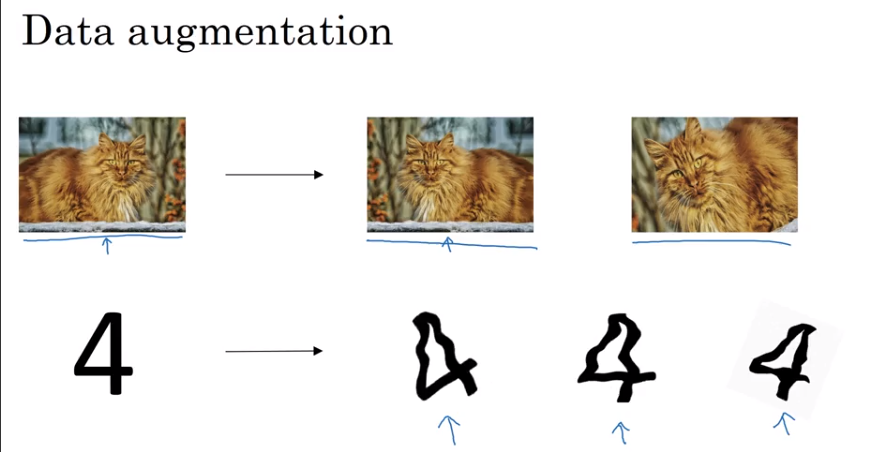

- **Data Augmentation**
  - in  cat classification 
    - adding rotation , scaling ,flipping horizontally. random zooming 
  - inexpensive way to give data

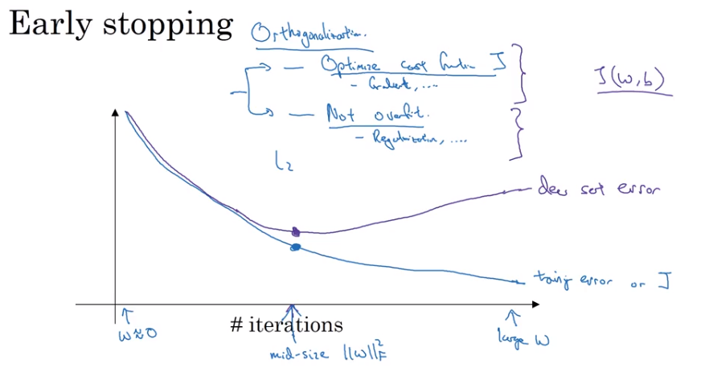

- **Early Stopping**
  - stop early when dev set error stops decreasing.
  - in early steps parameters weights will be close to zero (small random value.)
  - stopping early iteration may have small w's .
  - works likes regularization

#Setting up your Optimization problem

### Normalizing input

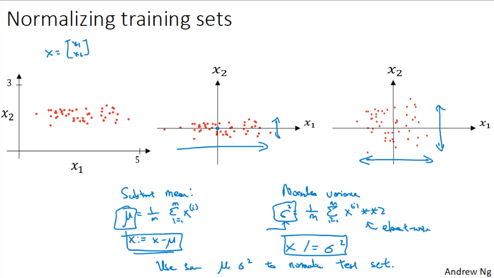

- mean shifted the data $\mu$
- scaled by variance $\sigma^2$
- use same $\mu$ and $\sigma^2$ to normalize the test set.
- **why normalize?**

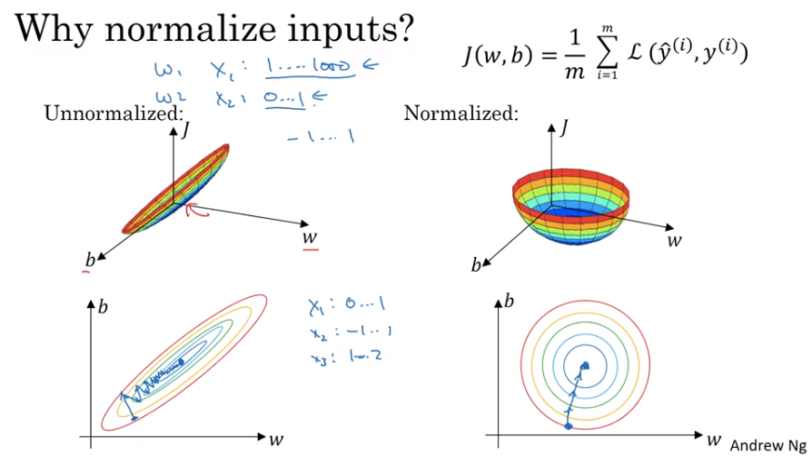

- cost function will look like squished ball rather than

- in unnormalized data gradient descent may  oscillate back and forth to find its way to minimum.

  