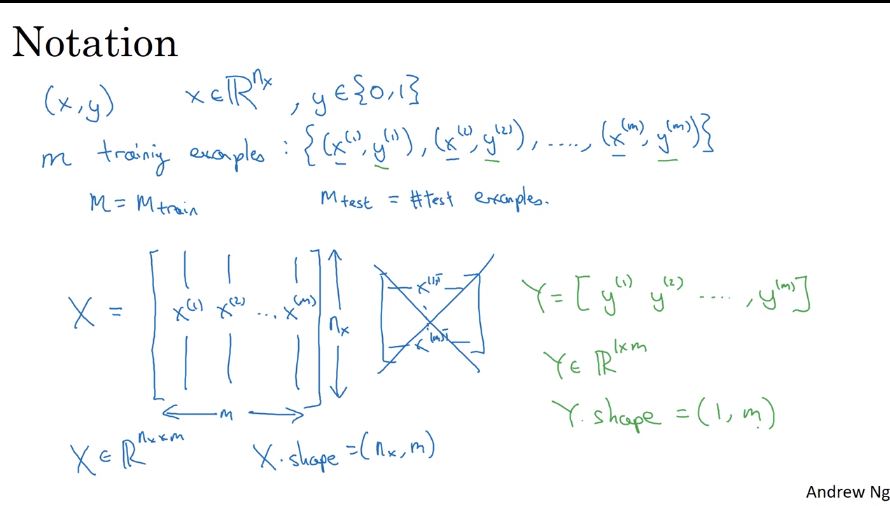
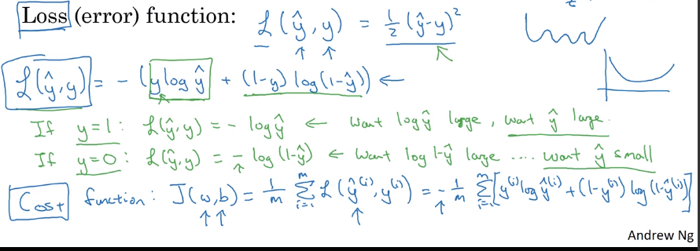

# Basics of Neural Network

## Binary classification

- consider m training examples.
- we have labels(y) for input(x) 
- input 64x64 image with 3 channels RGB
- $n_x$ = 12288
- X -> Y

### Notation

## Logistic Regression

- Given **x**
  - predict $Y = P(y=1|X)$
  - $X \in R^{n_{x}}$ and parameters: $w \in R^{n_{x}} , b \in R$ 
  - output $Y = \sigma(w^T x+b)$
  - $\sigma (z) = \frac{1}{1+e^{-z}}$
  - examples $\{(x^1,y^1),....(x^m,y^m,)\}​$
  - we want $\hat{y} \approx y$ 
  - Loss function $L(\hat{y},y)$ on single training example
    - Do not use square loss function. In LR optimization problem become non convex.
    -  we use :$ L(\hat(y)-y) =  -y\ log\ \hat{y}- (1-y)\ log\ (1-\hat{y})$
  - Cost function $J(w,b) = \frac{1}{m}\sum_\limits{i=1}^{m} L(\hat{y}-y)$
  - 
  - optimize for w and b to get lowest cost function

 # Coding Guidelines

## Vectorization

- wherever possible avoid explicit for-loops
- vectorize your code
- speed up to 300 times

### Vectoring Logistic Regression

$X = [ x_1^T,x_2^T.....x_m^T ] $ in $R^{n_x \times m}$ 

$w = [ w_1,w_2...w_n ] $ 

$z  = w^T X + [b,b,.....b] $  (b is $1 \times m $ vector)  

Z = np.dot(w.T,x)+b  in code b is 1x1 converted to 1xm automatically called broadcasting.

A = we must have a vectored valued activation function to get $\sigma(Z)$

A  = $\sigma(Z)$

$Y= [y^1,y^2....y^m]$

dz = A-Y

db = $\frac{1}{m} *np.sum(dz)$

dw = $\frac{1}{m} X \ dz^T$

## Python short-hands

- support broadcasting
- do not use rank 1 vector
- make a matrix nx1  to make a nx1 vector
- assert(a.shape==(5,1
- 

