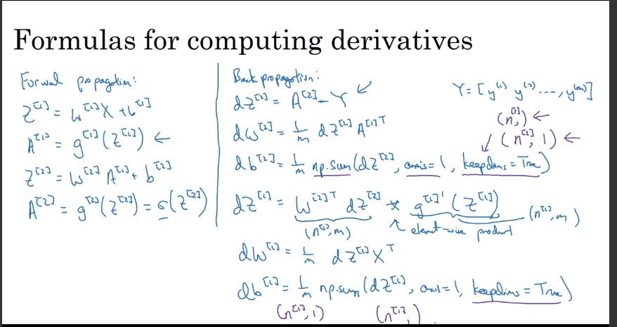
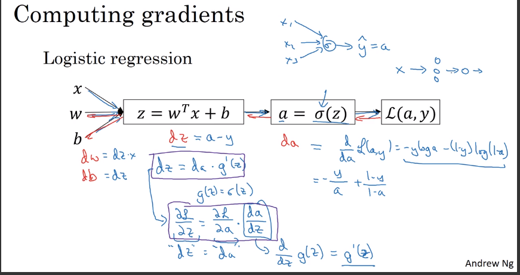
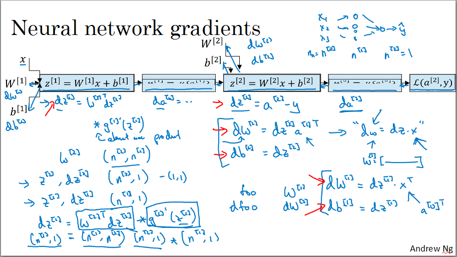
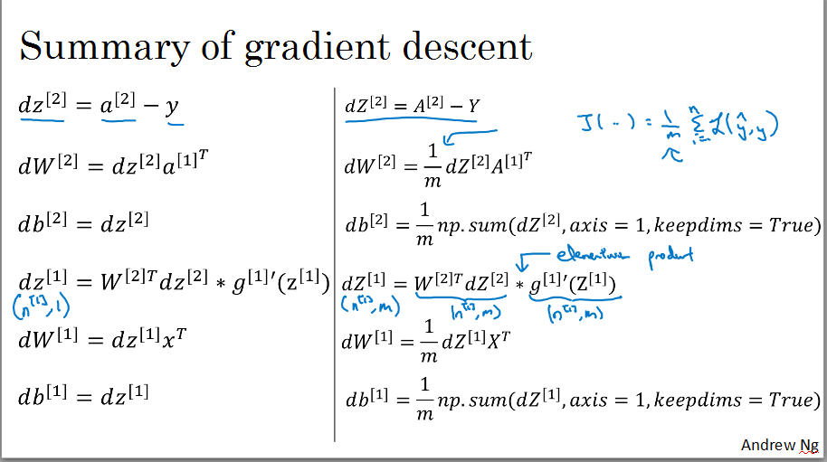

$X is (n_x,m) $dimensional matrix

m is #examples

$Z^{[i]} = W^{[i]} X+b^{[i]}$

square bracket have layer index

normal bracket have examples index

## Activation functions

Sigmoid:

- generally not used 
- used in last layer binary classification
- derivate = $\sigma(x)(1-\sigma(x))$

tanh function over sigmoid in hidden layer except final layer

- centralized the data over zero mean
- consider superior than sigmoid
- if Z is very large and very small  slope of gradient will be closer to zero and difficult to train
- derivate = $1-(tanh(x))^2$

ReLU (Rectified Linear Unit) = max(0,z) is mostly used

	- when zero is negative derivative is zero (disadvantage)

- most used Default
- derivate  = ${0\  if\ z < 0\ and\ 1\ if \ z >= 0}$

Leaky_ReLU(z) = max(0.01*z, z)

- derivate  = ${0.01\ if\ z < 0\ and\ 1\ if \ z >= 0}$

## Why use non linear activation function for NN

- The problem would same as linear optimization problem 

  - no need to go deeper layer

- In Regression problem linear activation function at the output layer.

  

