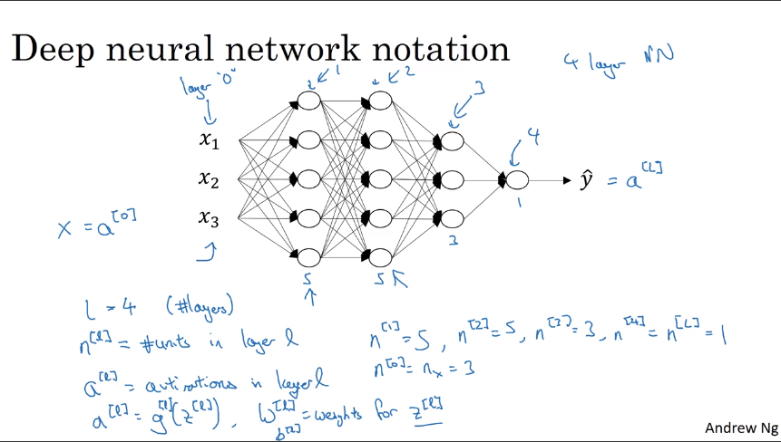
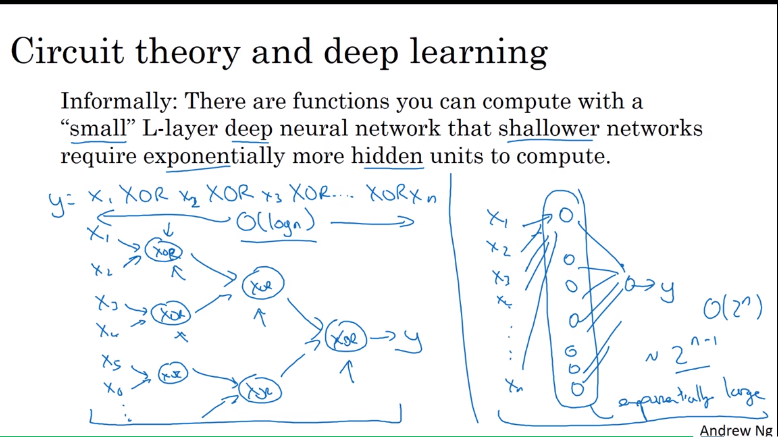
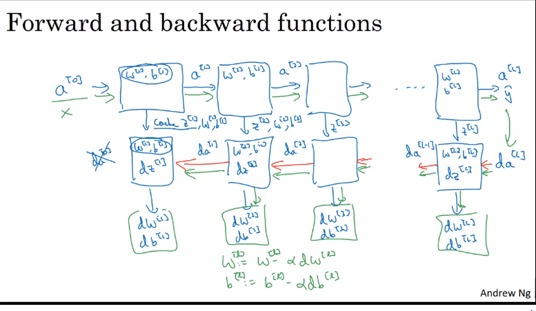

#  Deep Neural network

## Deep  L-layer neural network

### Notation

## General Forward Propagation equation

Input : $A^{[L-1]}$

OUTPUT : $A^{[L]}$, cache($Z^{[L]},W^{[L]},b^{[L]}$)

$Z^{[L]} =W^{[L]} A^{[L-1]} + b^{[L]} $

$A^{[L]} =g (Z^{[L]}) ​$

## General Back Propagation equation

Input : $dA^{[L]}$

OUTPUT : d$A^{[L-1]}$,$dW^{[L]},db^{[L]}$

$dZ^{[L]} =dA^{[L]} * g^{[L]'} (Z^{[L]}) $

$dW^{[L]} =\frac{1}{m}dZ^{[L]} .  A^{[L-1].T}  $

$db^{[L]} =\frac{1}{m} np.sum(dZ^{[L]},axis =1,keepdims = True) $

$dA^{[L-1]}  =  W^{[L]T}.dZ^{[L]}$

### Dimension of weight matrix should be

$W^{[L]}:(n^{[L]}, n^{[L-1]})$

$b^{[L]}:(n^{[L]},1)$

$dW^{[L]}:(n^{[L]}, n^{[L-1]})$

$db^{[L]}:(n^{[L]},1)$

dimension of z's and a's in vectorize implementation

$X = a^{[0]}:(n^{[0]}, m)$

$Z^{[L]}:(n^{[L]}, m)$

$A^{[L]}:(n^{[L]}, m)$

$dZ^{[L]}:(n^{[L]}, m)$

$dA^{[L]}:(n^{[L]}, m)$

## why Deep Representation

- in subsequent layers deep learning may learn simple features from the earlier layers
- and more complex features are learned from the earlier layers outputs
- deep learning is widely used in images and speech recognition

## Parameter vs Hyperparameter

- learning rate
- hidden layer size/ hidden units
- activation function 
- regularization params
- batch-size
- momentum etc.

